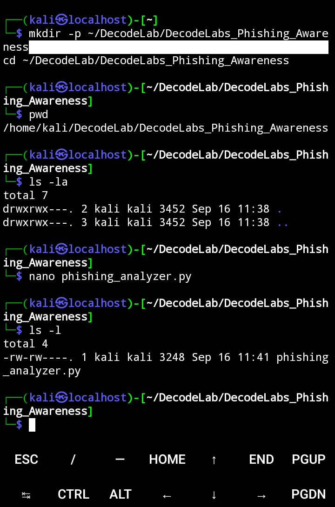
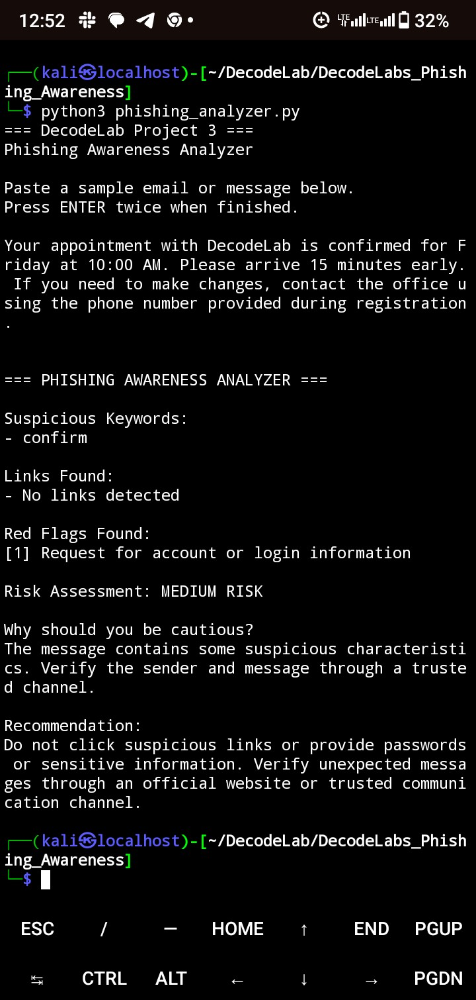
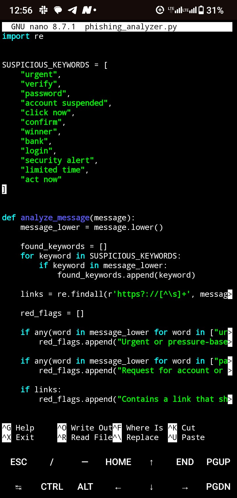
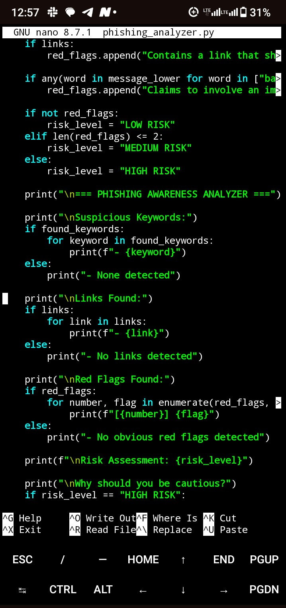
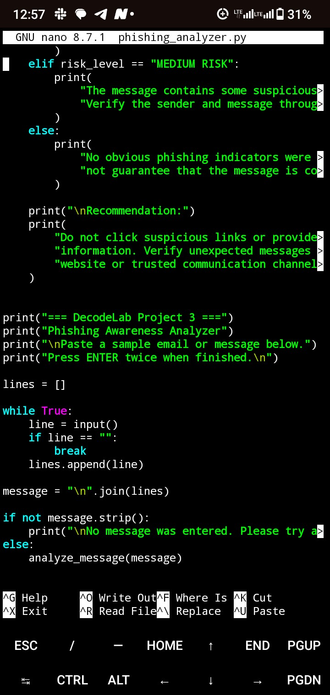
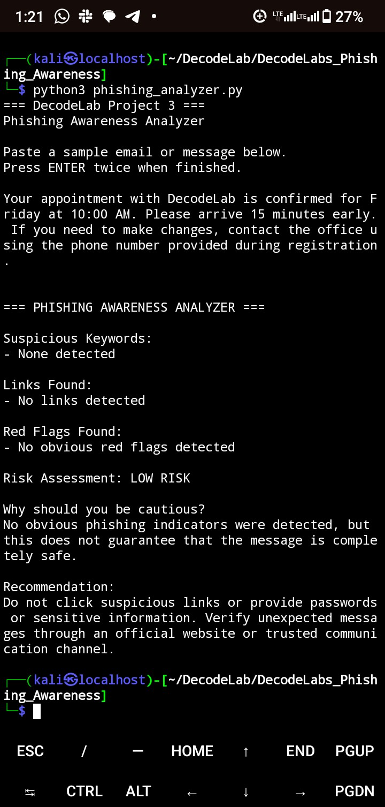
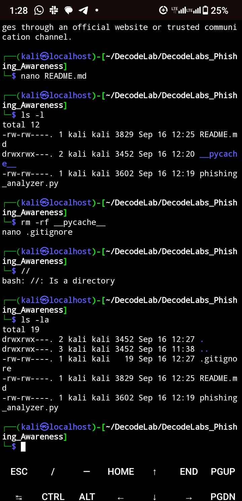
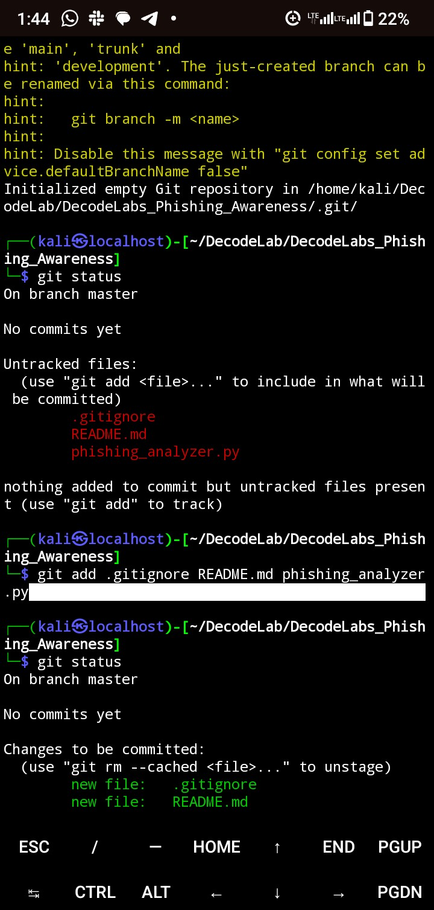
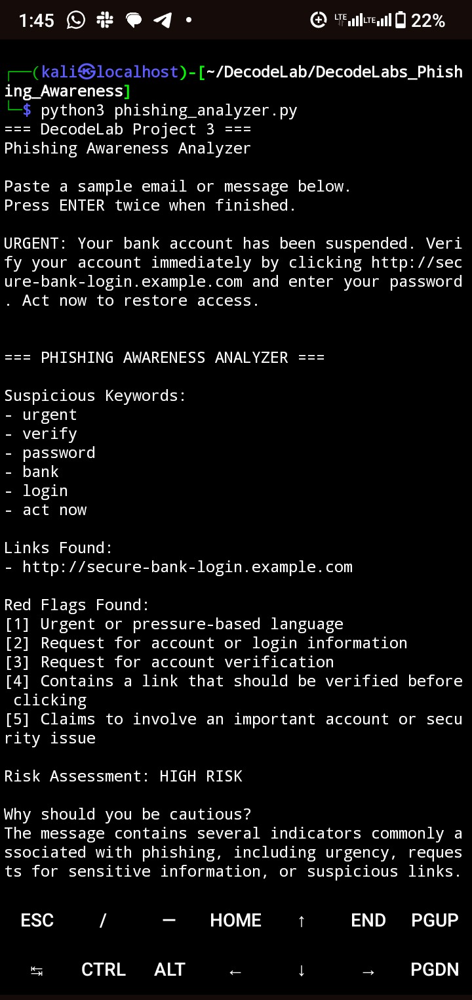
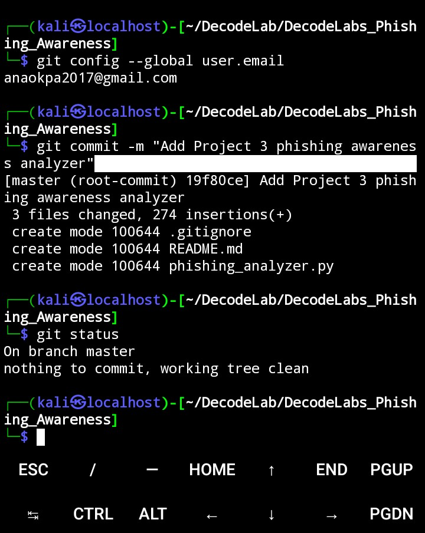

c# DecodeLab Project 3 — Phishing Awareness

## Overview

Phishing is a common social engineering attack where attackers use deceptive emails or messages to trick people into revealing sensitive information, clicking malicious links, or taking unsafe actions.

This project is a simple Python-based Phishing Awareness Analyzer created as part of the DecodeLab Internship Program.

The tool analyzes a sample email or message and identifies common phishing indicators such as suspicious keywords, links, urgency, account verification requests, and requests for login information.

#
# Project Goal

The goal of this project is to demonstrate basic threat analysis and security awareness by identifying warning signs commonly found in phishing messages.

## Key Features

- Detects suspicious phishing-related keywords.
- Extracts HTTP and HTTPS links from messages.
- Identifies common phishing red flags.
- Assigns a basic risk level.
- Explains why a message may be unsafe.
- Provides a security recommendation.
- Handles legitimate-looking messages with fewer or no indicators.

## Technologies Used

- Python 3
- Regular Expressions (`re`)
- Termux/Kali Linux
- Nano
- Git/GitHub

## How It Works

The analyzer compares the submitted message against a list of known phishing indicators.

It checks for:

1. Urgent or pressure-based language.
2. Requests for passwords or login information.
3. Requests to verify an account or identity.
4. Suspicious links.
5. Claims involving important accounts or security alerts.

Based on the detected indicators, the tool assigns a basic risk level:

- LOW RISK
- MEDIUM RISK
- HIGH RISK

## Example Phishing Test

### Sample Message

    URGENT: Your bank account has been suspended.
    Verify your account immediately by clicking
    http://secure-bank-login.example.com and enter
    your password. Act now to restore access.

### Detected Indicators

- Urgent language
- Bank/account-related claim
- Request for account verification
- Request for password
- Suspicious link
- Pressure to act immediately

### Result

    Risk Assessment: HIGH RISK

The analyzer explains that the message contains several indicators commonly associated with phishing.

## Legitimate Message Test

A simulated appointment message was also tested.

### Result

    Risk Assessment: LOW RISK

No obvious phishing indicators were detected.

This test was important because it helped identify and correct a false positive during development. The word "confirm" initially triggered an account-information warning even when it appeared in a normal appointment message.

The detection logic was improved so that account-verification warnings are triggered by specific phrases such as "confirm your account" rather than the ordinary word "confirm" alone.

## Security Recommendation

Users should:

- Avoid clicking suspicious links.
- Never provide passwords through unexpected messages.
- Verify unexpected requests through official communication channels.
- Check the sender and destination of links carefully.
- Treat urgent requests for sensitive information with caution.

## Limitations

This project is an educational phishing-awareness tool and does not replace professional email security systems.

A LOW RISK result does not guarantee that a message is safe. The analyzer only checks for indicators programmed into the tool.

More advanced versions could include sender-domain analysis, URL reputation checks, attachment analysis, machine-learning classification, and integration with security tools.

## Learning Outcome

This project strengthened my understanding of:

- Phishing attacks
- Social engineering
- Threat analysis
- Security awareness
- Pattern-based detection
- False-positive handling
- Basic Python automation

## Author

Christiana Okpa

## Program

DecodeLab Internship Program
Learning Outcomes

## Project Evidence

### 1. Project Structure

### 2. Phishing Detection — High Risk

### 3. Legitimate Message Test — Low Risk

### 4. Analyzer Code

### 5. Code Details

### 6. Git Status

### 7. Git Commit

### 8. Project Files

### 9. Terminal Test

### 10. Final Test

